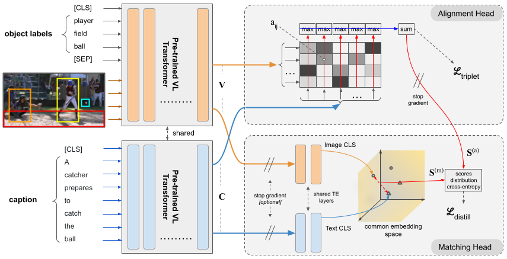

# ALADIN-2.0: Distilling Fine-grained Alignment Scores for Efficient Image-Text Matching and Retrieval
This is the code of my Master Thesis work from the title "Design and development of cross-modal retrieval techniques based on transformer architectures". The work is based on ALADIN, whose repository is available [here](https://github.com/mesnico/ALADIN).
## Introduction
With the advance of deep neural networks, Artificial Intelligence has achieved outstanding results in Computer Vision and Natural Language Processing subfields. The first is the branch of Artificial Intelligence that deals with how computers can gain high-level knowledge from images or videos, seeking to automate tasks done by the human visual system. Natural Language Processing (NLP) instead is the subfield related to the interactions between computers and human language, processing and analyzing natural language sentences and even generating new ones. 
    The outcomes reached in these two branches of AI led reasearchers to try to merge these two approaches in order to create multi-modal models capable of simultaneously processing together images and texts, resembling more what humans do during each day of their lives. In particular, in the last years, a lot of the reaserches in deep learning fields are approaching vision and language combined tasks, such as generating captions given an input image (image-captioning \cite{anderson2018bottom}), answering questions related to a picture (visual question answering \cite{anderson2018bottom}), or telling if an image is related to a given text (image-text matching \cite{messina2021transformer} \cite{messina2021fine} \cite{messina2022aladin}).
    Among these cross-modal tasks, image-text matching is particularly important: it consists of assigning a relevance score for each given (image, text) pair, where the score is high if the image is relatable to the text and low otherwise. Although this task is usually employed as a vision-language pre-training objective, it is crucial for cross-modal image-text retrieval, which consists of two sub-tasks: finding the top-relevant images representing a natural language sentence given as a query (image retrieval) and, vice versa, in finding a set of sentences that better describe an image given as a query (text retrieval). Matching two very different unstructured type of data such as pictures and sentences is a very difficult task, since high level knowledge of images and texts hidden semantics connections is required.
    
This thesis work aim to studying an existing cross-modal image-text retrieval model, ALADIN \cite{messina2022aladin}, and design, develop and test architectural changes in the structure of this model with the goal of improving its performances.

<p align="center">

</p>

## Installation
### Requirements
- Python 3.7
- Pytorch 1.7
- torchvision 0.8.0
- cuda 11.0

### Setup with Conda
```bash
# create a new environment
conda create --name aladin-2.0 python=3.7
conda activate aladin-2.0

# install pytorch1.7.0
conda install pytorch==1.7.0 torchvision==0.8.0 cudatoolkit=11.0 -c pytorch

export INSTALL_DIR=$PWD

# install apex
cd $INSTALL_DIR
git clone https://github.com/NVIDIA/apex.git 
cd apex
git checkout f3a960f80244cf9e80558ab30f7f7e8cbf03c0a0 
python setup.py install --cuda_ext --cpp_ext 

# install this repo
cd $INSTALL_DIR
git clone --recursive https://github.com/lorebianchi98/ALADIN-2.0.git
cd ALADIN-2.0/coco_caption
./get_stanford_models.sh
cd ..
python setup.py build develop

# install requirements
pip install -r requirements.txt

unset INSTALL_DIR
```

### Download OSCAR & Vin-VL Retrieval data:
Download the checkpoint folder with [azcopy](https://docs.microsoft.com/it-it/azure/storage/common/storage-use-azcopy-v10):
```
path/to/azcopy copy 'https://biglmdiag.blob.core.windows.net/vinvl/model_ckpts/coco_ir/base/checkpoint-0132780/' <checkpoint-target-folder> --recursive
```

Download the IR data
```
path/to/azcopy copy 'https://biglmdiag.blob.core.windows.net/vinvl/datasets/coco_ir' <data-folder> --recursive
```

Download the pre-extracted Bottom-Up features 
```
path/to/azcopy copy 'https://biglmdiag.blob.core.windows.net/vinvl/image_features/coco_X152C4_frcnnbig2_exp168model_0060000model.roi_heads.nm_filter_2_model.roi_heads.score_thresh_0.2/model_0060000/' <features-folder> --recursive
```

## Training
``` 
cd alad 
python train.py --data_dir <data-folder>/coco_ir --img_feat_file <features-folder>/features.tsv --eval_model_dir <checkpoint-target-folder>/checkpoint-0132780 --config configs/<config>.yaml --logger_name <output-folder> --val_step 7000 --max_seq_length 50 --max_img_seq_length 34
```

### Configurations
The parameter `--config` is very important. Configurations are placed in yaml format inside the `configs` folder:
- `alad-alignment-triplet.yaml`: Trains the alignment head using hinge-based triplet ranking loss, finetuning also the Vin-VL backbone;
- `alad-matching-triplet-finetune.yaml`: Trains only the matching head using hinge-based triplet ranking loss. The parameter `--load-teacher-model` can be used to provide a backbone previously trained using the `alad-alignment-triplet.yaml` configuration;
- `alad-matching-distill-finetune.yaml`: Trains only the matching head by distilling the scores from the alignment head. The parameter `--load-teacher-model` in this case IS NEEDED to provide a correctly trained alignment head, previously trained using the `alad-alignment-triplet.yaml` configuration;
- `alad-matching-triplet-e2e.yaml`: Trains the matching head, finetuning also the Vin-VL backbone;
- `alad-alignment-and-matching-distill.yaml`: Trains the whole architecture (matching+alignment heads) end-to-end. The variable `activate_distillation_after` inside the configuration file controls how many epochs to wait before activating the distillation loss (wait that the backbone is minimally stable); alternatively, you can load a pre-trained backbone using the `--load-teacher-model` option.

### Monitor Training
Training and validation metrics, as well as model checkpoints are put inside the `<output-folder>` path.
You can live monitor all the metrics using tensorboard:
``` 
tensorboard --logdir <output-folder>
```

## Testing
The following script tests a model on the 1k MS-COCO test set (you can download our best model from [here](https://drive.google.com/drive/folders/112fBqzpeQPnb9hk-HJ8vjkNRicXq1-gX?usp=sharing); it is obtained with the `alad-alignment-and-matching-distill.yaml` configuration.)
```
cd alad
python test.py --data_dir <data-folder>/coco_ir --img_feat_file <features-folder>/features.tsv --eval_model_dir <checkpoint-target-folder>/checkpoint-0132780 --max_seq_length 50 --max_img_seq_length 34 --eval_img_keys_file test_img_keys_1k.tsv --load_checkpoint <path/to/checkpoint.pth.tar>
```
To test on 5k test set, simply set `--eval_img_keys_file test_img_keys.tsv`.

[//]: # (## Citation)

[//]: # (If you found our work useful for your research, please cite our paper:)

[//]: # ()
[//]: # (TODO)
